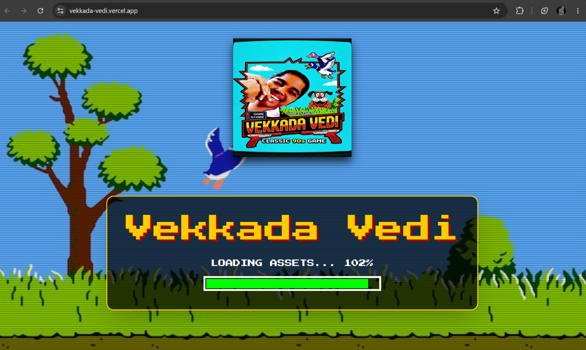
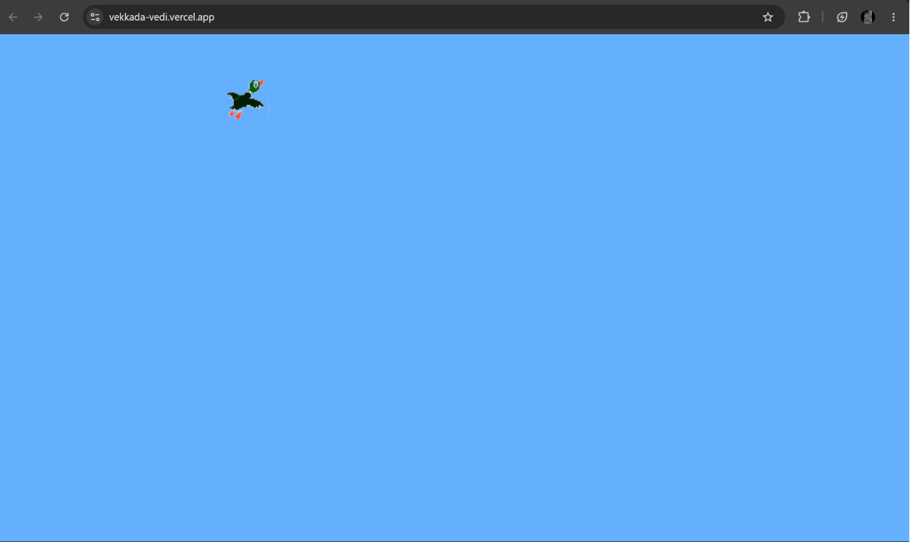
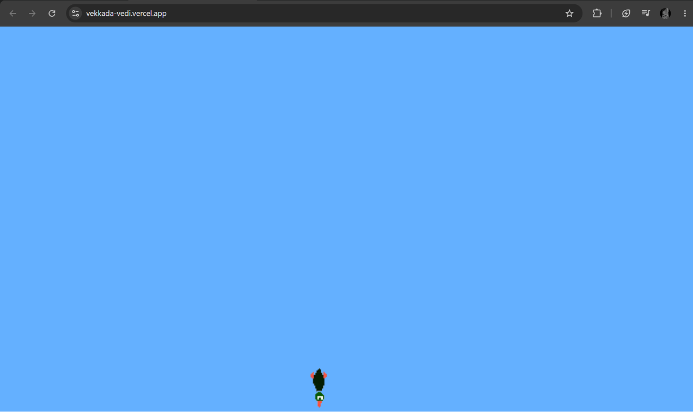

# Vekkada Vedi 🎯

## Basic Details
### Team Name: Two Brain Cells

### Team Members
- Team Lead: Alwin Emmanuel - AISAT
- Member 2: Sivani NS - AISAT

### Project Description
The concept of a "useless" Duck Hunt game—one entirely stripped of a scoring system, rounds, or a definitive conclusion—transforms the experience from a competitive arcade challenge into a piece of interactive, existential digital art. By removing the traditional dopamine loop of escalating difficulty and numerical reward, the game becomes a stark meditation on repetition, futility, and the mechanics of pure action without consequence.

Without a score counter ticking upward at the top of the screen, the player is robbed of external validation. In traditional game design, numbers provide a metric for success, creating a tangible sense of progression that drives the player to keep pulling the trigger. When that metric is erased, the relationship between the player, the digital gun, and the pixelated duck shifts dramatically. The act of shooting is no longer a means to an end; it is simply an action performed in a void. A duck flies, a gunshot echoes, a sprite tumbles to the bottom of the canvas, and the cycle instantly resets. Whether the player hits a hundred targets in a row or lets a thousand fly away untouched into the endless blue sky, the universe of the game remains entirely indifferent.

### The Problem (that doesn't exist)
Modern gaming is plagued by toxic productivity: high scores, leaderboards, achievement badges, and the relentless pressure to "win" or "level up." People can no longer stare blankly at a screen and shoot virtual waterfowl without feeling the crushing weight of capitalism demanding an ROI on their leisure time.

### The Solution (that nobody asked for)
We built **Vekkada Vedi**—an infinitely recurring, completely consequence-free Duck Hunt simulator. There is no score. There are no levels. There is no winning, and there is no losing. Just an immortal duck, an endless blue sky, nostalgic 90s sound effects, and a gun that fires bullets into a philosophical void. 

## Technical Details
### Technologies/Components Used
For Software:
- **Languages:** JavaScript (ES6+), Tailwind CSS
- **Frameworks:** React.js, Vite
- **Libraries:** HTML5 Canvas API (for rendering), Native Web Audio API (for sound effects)
- **Tools:** Git, VS Code, Arch Linux

## Implementation
For Software:

# Installation
Clone the repository and install dependencies inside your project folder:
```bash
git clone [https://github.com/Ajallen14/vekkada-vedi.git](https://github.com/Ajallen14/vekkada-vedi.git)
cd vekkada-vedi
npm install
```

# Run
``
npm run dev``

### Project Documentation
For Software:

# Screenshots (Add at least 3)

*The vintage 90s loading screen with the bouncing duck logo.*


*The vintage 90s duck game.*




### Project Demo
# Video
[Add your demo video link here](medias/video.mp4)
*Explain what the video demonstrates*


## Team Contributions
- Alwin Emmanuel : Frontend 
- Sivani NS: Assets , README


---
Made with ❤️ at TinkerHub Useless Projects 


